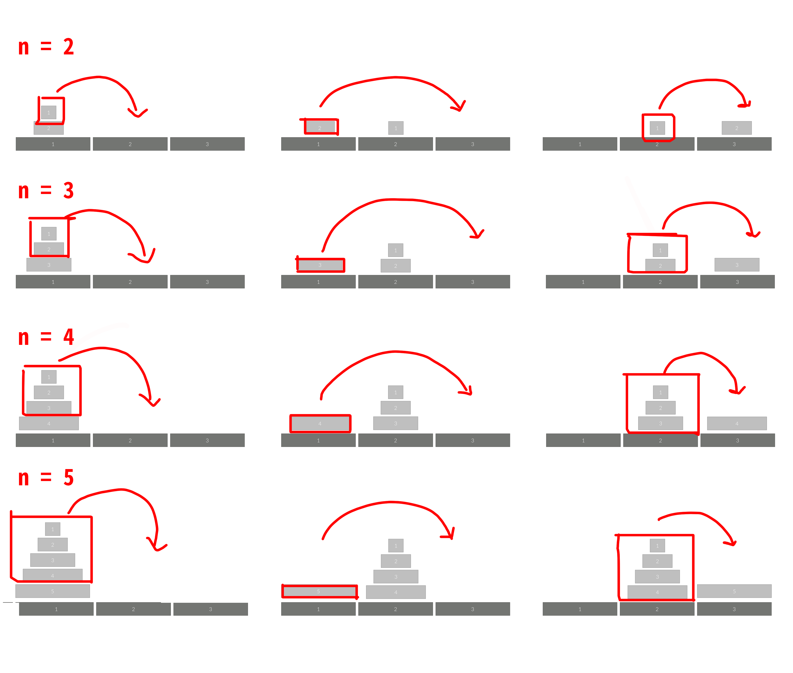

### 1. 요약

세 개의 장대가 있고 첫 번째 장대에는 반경이 서로 다른 n개의 원판이 쌓여 있다. 각 원판은 반경이 큰 순서대로 쌓여있을 때, 첫 번째 장대에 있는 원판을 세 번째 장대로 옮기려 한다.

1. 한 번에 한 개의 원판만을 다른 탑으로 옮길 수 있다.
2. 쌓아 놓은 원판은 항상 위의 것이 아래의 것보다 작아야 한다.

이 작업을 수행하는데 필요한 최소 이동 횟수와 이동 순서를 구하는 문제이다.


### 2. 아이디어

이동 횟수까지는 `2 * hanoi(n-1) + 1` 이런식으로 쉽게 구하겠는데, 이동 경로가 조금 복잡했다.
N이 짝수일 때와 홀수일 때 먼저 옮겨야하는 위치가 다른데다가, 판을 옮길 때마다 위치가 달라지는데 어떻게 해야할지 막막했다. 그런데, 옮기는 상황도 재귀적으로 생각하면 해결된다.

다음은 n이 2~5일 때 하노이탑을 옮기는 과정을 재귀적으로 표현한 것이다.



이를 간단한 코드로 나타내면 다음과 같다.

```python
def f:
    f(n-1원판전체, 1->2 이동)
    n번원판 1->3 이동
    f(n-1원판전체, 2->3 이동)
```


### 3. 코드

```python
def hanoi(n,a,b,c):
    if n == 1:
        move.append([a,c])
    else:
        hanoi(n-1,a,c,b)
        move.append([a,c])
        hanoi(n-1,b,a,c)
        
move = []
hanoi(int(input()),1,2,3)

print(len(move))
print("\n".join([' '.join(str(i) for i in row) for row in move]))
```


### References

- [슈퍼짱짱 - 하노이 탑 이동순서](https://bit.ly/3cVOdj4)

