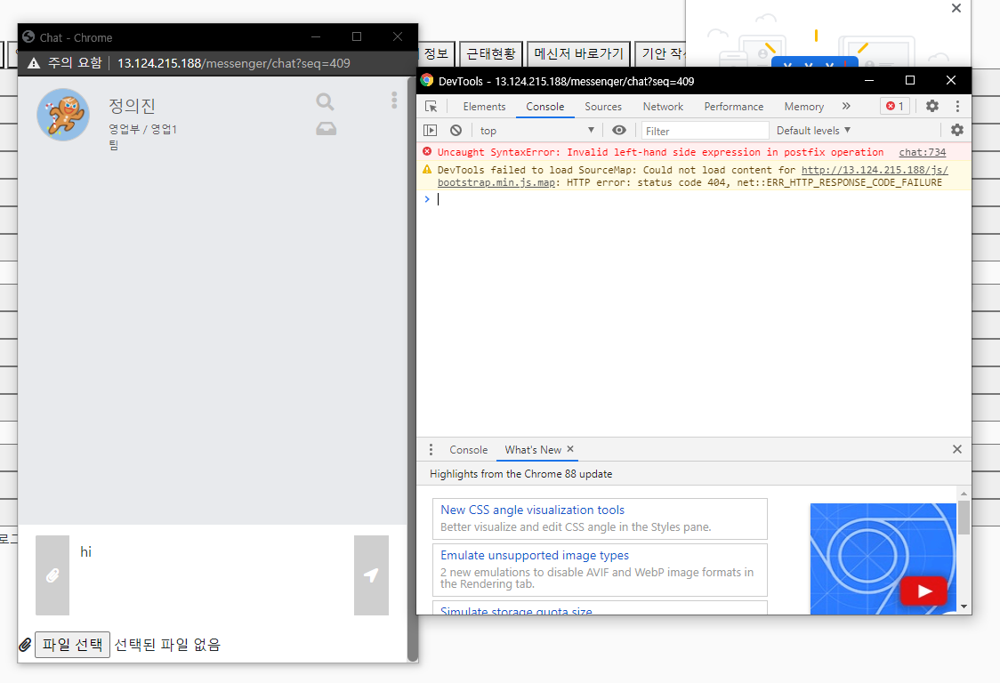
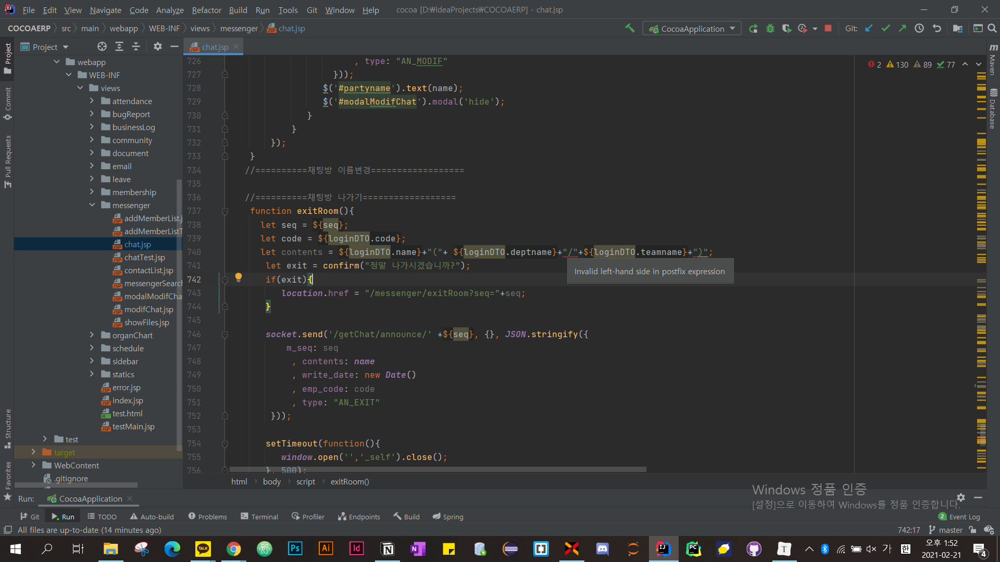

### 오류 : Invalid left-hand side expression in postfix operation

예상치 못한 할당이 일어났습니다. 즉 비교연산자를 써야하는 자리에 할당연산자를 썼다는 이야기이다. 예를 들면, "`=`" 부호는 값을 변수에 할당하고,  "`==`" 나 "`===`"는 값을 비교하는 연산을 한다. 

나같은 경우에는 jstl에서 문자열을 더할 때 에러가 발생한 것 같다.

**수정 전**

```javascript
let contents = ${loginDTO.name}+"("+ ${loginDTO.deptname}+"/"+${loginDTO.teamname}+")";
```

**수정 후**

```javascript
let contents = "${loginDTO.name}(${loginDTO.deptname}/${loginDTO.teamname})";
```


### References

[ReferenceError: invalid assignment left-hand side](https://developer.mozilla.org/ko/docs/Web/JavaScript/Reference/Errors/Invalid_assignment_left-hand_side)
