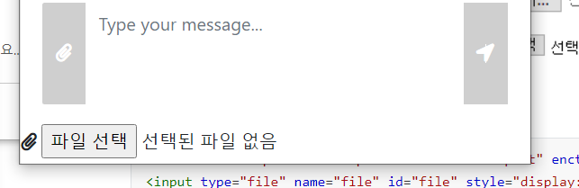
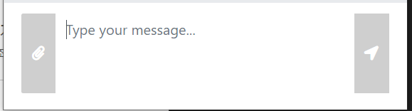

### [파이썬] 블랙잭 문제

N장의 카드에 써져 있는 숫자가 주어졌을 때, M을 넘지 않으면서 M에 최대한 가까운 카드 3장의 합을 구해 출력하는 문제이다. 예를 들어서 N이 5이고, M이 21로 주어지고, 카드 5장이 다음과 같을 때 6,7,8의 합인 21이 최대값이다.

**입력**

```python
5 21		# N=5 M=21
5 6 7 8 9	#카드 5장에 쓰여진 수
```

**출력**

```python
21
```

**나동빈 강사님 풀이**

조합의 경우의 수는 `n(n-1)(n-2) / 3!`이다. 따라서 3중 for문을 돌려서 모든 경우의 수를 생각해서 해결할 수 있다. 

```python
n, m = list(map(int, input().split(' ')))
data = list(map(int, input().split(' ')))

result = 0
length = len(data)

count = 0
for i in range(0, length):
    for j in range(i+1, length):
        for k in range(j+1, length):
            sum_value = data[i] + data[j] +data[k]
            if sum_value <= m:
                result = max(result, sum_value)
print(result)
```

### max

매개변수로 들어온 반복이 가능한 인자들 중에 가장 큰 데이터를 반환한다.

```python
result = max(result, sum_value)
```


---


### Session과 Model

`session`에 있는 객체는 다시 `model`에 담아서 jsp로 보내주지 않아도 사용할 수 있다. 똑같이 jstl 문법을 사용해서!! 오늘 `loginDTO` 를 `model`에 담지 않아도 jsp에서 `${loginDTO.code}` 에 값이 나오는 것을 보고 약간 충격을 받았다...아직까지 나만 모르고 있었던 걸 수도 있어서 부끄럽지만 적어두기로 한다.


### input type=file 버튼을 다른버튼으로 대체해보기

`<input type="file" id="file">`  을 `display:none`으로 설정하고 원하는 버튼에 파일버튼을 눌렀을 때처럼 이벤트를 부여하면 된다.

```css
/* 파일 버튼 숨기기 */
#file{
  display: none;
}
```

```javascript
// 파일 못생긴 버튼 대신 예쁜버튼 눌렀을 때 파일선택 기능 실행하기
$("#attach_btn").click(()=>{
    $("#file").click();
});
```








### References

[파이썬 max, min 함수에 대해서](https://blockdmask.tistory.com/411)

[input File 버튼을 hidden으로하고 외부버튼으로 파일 선택](https://kimtaekju-study.tistory.com/165)

