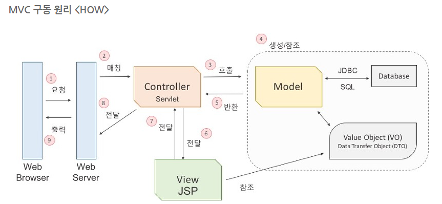

### 오늘 한 일

4/1에 한 솔루션 회사의 면접이 잡혔다. 그래서 그에 대한 기술면접 준비를 간단히 해보았다. 다 아는 내용도 말로 하려니 어렵고, 은근히 헷갈리는 부분도 있어서 정리를 해두려고 한다. 대부분의 내용은 [한재엽님의 저장소](https://github.com/JaeYeopHan/Interview_Question_for_Beginner)에서 습득한 내용이다.

- 객체지향 프로그래밍

- RESTFul API

- GET 방식과 POST 방식의 차이점
  - GET 방식
    - 요청하는 데이터가 `HTTP Request Message의 Header` 부분에 url에 담겨서 전송됨
    - 데이터의 크기가 제한적이고 보안이 필요한 데이터가 노출될 수 있다.
    - select적인 성향을 가지고 있다.(데이터를 가져와서 보여줌)
    - 브라우저에서 caching할 수 있다. 따라서 목적에 맞지 않게 쓴다면 기존에 caching되었던 데이터가 응답돌 가능성이 존재한다.
  - POST 방식
    - `HTTP Message 의 Body`부분에 데이터가 담겨져 전송
    - 데이터의 크기가 GET방식보다 크고 보안면에서 낫다.
    - 서버의 값이나 상태를 변경, 혹은 추가하기 위해서 사용된다.

- MVC 아키텍처

  - Controller

    : 일종의 조정자. 클라이언틔 요청을 받았을 때, 실제 업무를 수행하는 모델 컴포넌트를 호출
    또는 클라이언트가 보낸 데이터가 있다면, 모델에 전달하기 쉽게 데이터를 가공한다.

  - Model

    : 데이터를 처리하는 부분(비지니스 로직을 구현하는 영역)
    데이터를 추출, 저장, 삭제, 업데이트 등의 작업 수행

  - View

    : 사용자에게 출력할 화면을 만들고, 웹브라우저에 전송

    

### References

- [Technical Interview Guidelines for Beginners](https://github.com/JaeYeopHan/Interview_Question_for_Beginner)

- [MVC 아키텍쳐에 대한 이해](https://asfirstalways.tistory.com/180)