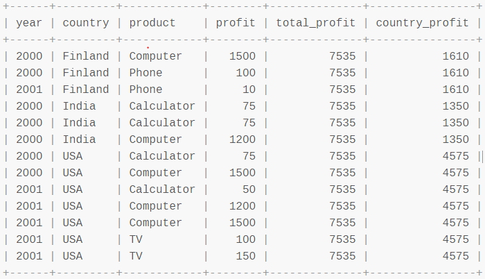

## ✅ Today I Learned

### [mysql] ROLLUP 함수 - 항목별 합계와 전체합계 구하기

여러 항목으로 `GROUP BY`를 한다음, <span style='color:red'>중간 그룹별로 통계값이 필요한 경우</span>에 유용한 함수이다. 주로 분류해야되는 값이 많은 데이터를 다룰 때, 통계를 내야할 때 사용한다.

다음은 단순한 `GROUP BY` 를 한 경우와  `ROLLUP` 을 한 경우를 비교한 것이다.

  

**GROUP BY 한 경우**

```sql
SELECT country, year, genre, SUM(sales) 
  FROM booksales GROUP BY country, year, genre;
```


​    

**ROLLUP 한 경우**

```sql
SELECT country, year, genre, SUM(sales) 
  FROM booksales GROUP BY country, year, genre WITH ROLLUP;
```


  

보다시피 `ROLLUP`을 한 경우 중간중간 통계값이 생성되는 것을 볼 수 있다.
단, 현재 `ROLLUP`과 `ORDER BY`를 같이 지원하지는 않는다.

​    

<br>

### [mysql] Grouping 함수

`ROLLUP` 과 함께 쓰기 좋은 함수로 `Grouping` 함수가 있다. ROLLUP 한 중간통계값에서 NULL 로 나오기 때문에, 실제로 NULL인 값과 혼동될 우려가 있다. 이럴 때 <span style='color:red'>어떤 값이 롤업으로 그루핑 된 것인지</span>를 알 수 있게 하는 것이 `Grouping`  함수이다.  

아쉽게도 mariaDB에서는 동작하지 않아서 찾아보니 공식문서에 이렇게 코멘트가 달려있는 것으로 보아 `Grouping` 함수를 지원하지 않는듯 했다.  


- [mariaDB 공식문서 - ROLLUP](https://mariadb.com/kb/en/select-with-rollup/#comment_4413)

  

mysql을 사용한다면 다음과 같이 사용할 수 있다.

```sql
SELECT
	name, size, SUM(quantity) AS quantity,
	GROUPING(name) AS grp_name,
	GROUPING(size) AS grp_size
FROM t1
GROUP BY name, size WITH ROLLUP;
```


  

다음 공식문서를 참고하였다.

- [mysql 공식문서 - Grouping](https://dev.mysql.com/doc/refman/8.0/en/miscellaneous-functions.html#function_grouping)
- [ROLLUP 고급사용법 GROUPING 함수](https://myjamong.tistory.com/191)

​    


<br>

### [mysql] SUM() OVER() 함수 - 그룹별 누적 합계 구하기

예를 들어 A, B, C, D 라는 기준으로 `Group By`를 한 상태에서, A와 B까지만 Grouping한 값의 `Sum(컬럼1)` 의 값이 필요한 경우가 있다. 
이럴 때 `ROLLUP`을 쓰기는 아주 번거롭고, 대신 `SUM() OVER()` 함수를 사용하면 된다.   

```sql
SELECT
	year, country, product, profit,
    SUM(profit) OVER() AS total_profit,
    SUM(profit) OVER(PARTITION BY country) AS country_profit
FROM sales
ORDER BY country, year, product, profit;
```



​    

## ❣️ Today I Feel

- 요새 시간이 좀 여유가 있어서 기존에 했던 작업을 피드백을 받으며 리팩토링을 하고 있다. 나름 효율(?)적으로 짰다고 생각했는데, 다시 할 때마다 머리를 쥐어뜯으며 하고 있다ㅎㅎ 오늘도 하루종일 sql 쿼리를 다시 짰는데, 내일 다시 피드백을 받을 예정..

​    

## 🔜 앞으로의 공부 방향

- 5시 기상은 대체 어떻게 했던 것일까..요새 눈은 뜨는데 번번히 실패한다. 그래도 눈을 뜨는 것만 해도 기적이라고 생각하면서 감사하는 중이다. 내일은 해보자..일단 일찍 자는 것부터..
- 아침에 공부를 해서 공부에 대한 부채감을 덜고, 저녁에는 운동이나 책을 읽는 것이 좋겠다. 야근을 할 수도 있으니 저녁에는 부담이 없도록 하자.
- 그러려면 저녁 9시반~10시에는 씻고 10시반에는 자야한다. 오늘부터 해보자 아자.

​    

## 👍 오늘의 추천사이트

[YaHwang's Data Pipeline 노션페이지](https://www.notion.so/yahwang/04cc94e4d4ef44df923ea89479497405?v=07d2c3c012d043499cdcc275999989bb)

이 사람 노션...엄청나다!! 나도 저렇게 정리하고 싶다..ㅠ

​    
