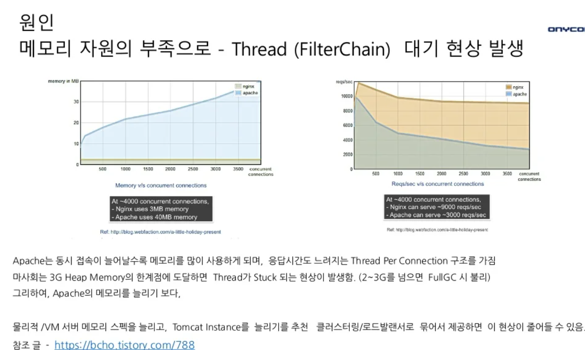

### ✅ Check Point

- DB 시스템에서 전체 성능에 가장 큰 영향을 미치는 요인은 스토리지의 I/O성능
  - 일반 물리서버에서 10000rpm SAS 하드디스크는 150 IOPS 성능을 내는 것으로 알려져있어..
  - 8개의 디스크 사용시 150 x 8 = 1200 IOPS 정도의 성능 기대
- mariadb 최대 사용 메모리 제한도 확인해 봐야함
- 또한, 클라우드 환경에서 따로 확인해야 하는 지표들이 몇 가지 더 있는데, 다음과 같다고 한다.

 

근데 이거를 언제 다 확인하지..쩝..
 

### References

- [클라우드 기반 DB 부하 테스트](https://tech.com2us.com/blog/3552)

- [실전 서버 부하테스트 노하우](https://www.slideshare.net/arload/bestcon-load-test)

- [Apache Tomcat Tuning (아파치 톰캣 튜닝 가이드)](https://bcho.tistory.com/788)

- [How to Monitor Your Server Health & Performance During a JMeter Load Test](https://www.blazemeter.com/blog/how-monitor-your-server-health-performance-during-jmeter-load-test)

 