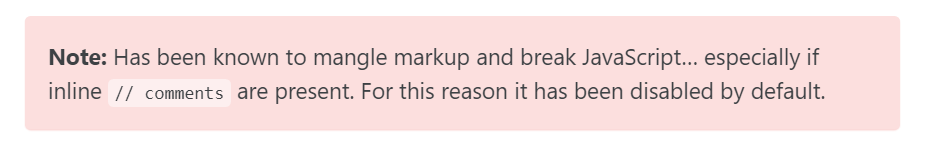
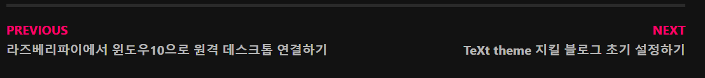

미루기만 했던 블로그 개편과 꾸미기에 대한 내용을 이 포스팅에 정리하려고 한다.


## 시작한 이유

쏘 심플한 퀘스쳔...정리하려고 쓴 블로근데 정리가 안돼서..

그리고 테마를 받아서 쓰다보니 아무래도 내 입맛에 맛게 예쁘지도 않다.

그래서 하나하나 뜯어고친 기록들을 이번 포스팅에 남기려고 한다.

한번에 잘하면 좋겠지만 그렇게는 힘들고..차근차근 업데이트할 예정이다.


## 개선 내역

### favicon 추가

다음과 같은 이미지를 파비콘으로 추가해주었다. 블로그가 한층 귀여워졌다.


### 폰트 변경

`__reset.scss` 파일을 조금씩 수정하다가 `main.scss` 파일로 덮어씌우는 방식으로 고쳤다.


### On this Page(toc) 만들기

```yaml
toc: true # 오른쪽 부분에 목차를 자동 생성해준다.
toc_label: "table of content" # toc 이름 설정
toc_icon: "bars" # 아이콘 설정
toc_sticky: true # 마우스 스크롤과 함께 내려갈 것인지 설정
```

페이지에 다음과 같이 추가해주면 된다. 그런데 나는 모든 포스팅에 On this Page가 필요하므로 어딘가 싱글페이지 설정에 추가해줘야겠다고 생각했다.

우선 On this Page라는 글자가 마음에 들지 않아서 Table of Contents로 수정하기 위해서 `ui-text.yml` 파일을 열어 `toc_label`을 수정해주었다.


## 앞으로 남은 개선 사항

- 필요한 VsCode 플러그인 다운받기

- 페이지에 삽입되는 이미지 날짜별로 폴더에 넣기

- callout 색깔별로 어떻게 쓰는지 알아내기

  

- prev, next에 해당 포스트의 제목 적어주기

  


## References

- [다크모드](https://etch-cure.github.io/blog/toggle-dark-mode/)

- [폰트수정하기](https://evenharder.github.io/blog/jekyll-change-fonts/)

- [지킬 블로그 수정하기 편한 vscode 플러그인 추천](https://etch-cure.github.io/blog/github-pages-plugin/)

- [기본 설정 및 on the page 추가](https://syki66.github.io/blog/2020/04/12/minimal-mistakes-theme.html)

- [식빵맘 - 블로그 마크다운 꿀팁](https://ansohxxn.github.io/blog/markdown/)

