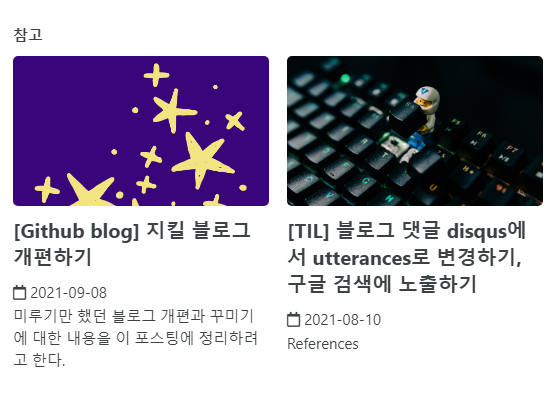
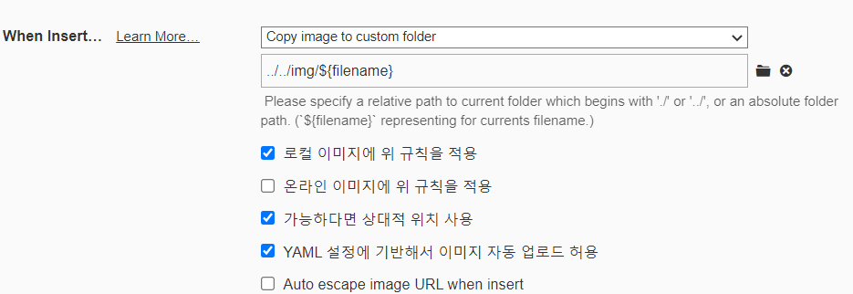
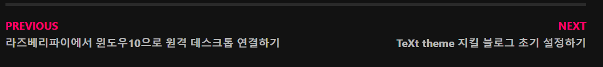

미루기만 했던 블로그 개편과 꾸미기에 대한 내용을 이 포스팅에 정리하려고 한다.
{: .notice--primary} 


## 시작한 이유

쏘 심플한 퀘스쳔...정리하려고 쓴 블로근데 정리가 안돼서..

그리고 테마를 받아서 쓰다보니 아무래도 내 입맛에 맛게 예쁘지도 않다.

그래서 하나하나 뜯어고친 기록들을 이번 포스팅에 남기려고 한다.

한번에 잘하면 좋겠지만 그렇게는 힘들고..차근차근 업데이트할 예정이다.


<br>

## 개선 내역

### (1) favicon 추가

다음과 같은 이미지를 파비콘으로 추가해주었다. 블로그가 한층 귀여워졌다.


### (2) 폰트 변경

`__reset.scss` 파일을 조금씩 수정하다가 `main.scss` 파일로 덮어씌우는 방식으로 고쳤다.


### (3) On this Page(toc) 만들기

```yaml
toc: true # 오른쪽 부분에 목차를 자동 생성해준다.
toc_label: "table of content" # toc 이름 설정
toc_icon: "bars" # 아이콘 설정
toc_sticky: true # 마우스 스크롤과 함께 내려갈 것인지 설정
```

페이지에 다음과 같이 추가해주면 된다. 그런데 이렇게 하면 모든 페이지마다 yml설정에 써줘야하니까 번거롭다. 나는 모든 포스팅에 On this Page가 필요하므로 어딘가 싱글페이지 설정에 추가해줘야겠다고 생각했다.

우선 **On this Page**라는 글자가 마음에 들지 않아서 `ui-text.yml` 파일을 열어 `toc_label`을 **Table of Contents**로 수정해주었다.

그런다음 `_config.yml`파일에서 post 설정에 `toc`, `toc_icon`, `toc_sticky` 를 설정해주었다. `toc_label`은 앞서 설정했으니 패스.

```yaml
# Defaults
defaults:
  # _posts
  - scope:
      path: ""
      type: posts
    values:
      layout: single
      author_profile: true
      read_time: false
      comments: true
      share: true
      related: true
      sidebar_main: true
      toc: true
      toc_icon: "bars"
      toc_sticky: true
```


### (4) notice 사용하기

마치 노션에서 콜아웃과 같은 기능이다. 색이 있는 글박스로 주의사항, 공지, 강조하고 싶은 문단에 사용하기 좋아보인다.

종류는 다음과 같다.

**Default 문자박스** /  `.notice`
{: .notice} 

**Primary 문자 박스** / `.notice--primary`
{: .notice--primary} 

**Info 문자 박스** / `.notice--info`
{: .notice--info} 

**Warning 문자 박스** / `.notice--warning`
{: .notice--warning} 

**Success 문자 박스** / `.notice--success`
{: .notice--success} 

**Danger 문자 박스** / `.notice--danger`
{: .notice--danger} 

<br>

문단 바로 밑에 (shift+enter) `.notice--xxx` 를 넣으면 알아서 notice가 생성이된다. 
하지만 여러 문단, 코드등을 강조하고 싶다면 div의 class를 `notice--xxx`로 주는 방법도 있다.

<div class="notice--primary" markdown="1">
`markdown="1"` 속성은 내부에서 markdown을 인식하게 하기 위한 것


내부 코드블럭 등도 가능하다.

```java
System.out.println("hello")
```
</div>


### (5) Teaser (포스팅의 썸네일) 추가하기

기본 teaser는 `_config.yml`에서 teaser 항목에 추가해주면 된다.

해당 포스팅에 맞는 썸네일 이미지를 넣고 싶다면 yaml formatter에 다음과 같이 추가한다.

```yaml
header:
  teaser: /assets/images/page-header-teaser.png
```


그럼 짠!! 하고 썸네일이 내가 원하는 이미지로 바뀐것을 확인할 수 있다. 뿌듯😀




<br>

## 앞으로 남은 개선 사항

- ~~필요한 VsCode 플러그인 다운받기~~

- 페이지에 삽입되는 이미지 날짜별로 폴더에 넣기

  : typora에서 이미지 붙여넣는 설정을 다음과 같이 바꿔주었다. 이제 포스팅마다 따로 설정을 해주지 않아도, img 폴더 안에 해당파일이름으로 폴더가 생성되고, 거기에 이미지가 저장될 것이다. 

  

- prev, next에 해당 포스트의 제목 적어주기

  

- Category-archive 페이지 제목을 오밀조밀하게 설정하기
  지금은 너무 제목이 커서 한눈에 안들어온다.
  
- 컬러설정하기
  - hover 했을 때도 그렇고, 링크도 색깔이 잘 안나온다.
  
- 링크를 넣을 때 마치 카카오톡처럼 해당 페이지의 썸네일이 나오면 좋겠다

- 404에러 페이지 만들기

- 카테고리 정리하기

- 필요없는 포스팅 정리하기

- 이름규칙 : 최대한 영어로 안겹치도록 정하자

- `H2` 와 `H3` 사이에 생기는 간격이 미묘하다..조정이 가능했으면

- 코드블럭 색깔 조절하기 및 행넘버 표시하기

- 포인트 컬러를 좀 조절했으면 좋겠다.

- 포스팅 목록에 카테고리나 태그가 같이 떴으면 좋겠다.

- 스크롤이 아래 있을때 위로 올라가는 버튼


<br>

## References

- [다크모드](https://etch-cure.github.io/blog/toggle-dark-mode/)
- [폰트수정하기](https://evenharder.github.io/blog/jekyll-change-fonts/)
- [지킬 블로그 수정하기 편한 vscode 플러그인 추천](https://etch-cure.github.io/blog/github-pages-plugin/)
- [기본 설정 및 on the page 추가](https://syki66.github.io/blog/2020/04/12/minimal-mistakes-theme.html)
- [식빵맘 - 블로그 마크다운 꿀팁](https://ansohxxn.github.io/blog/markdown/)
- [문자박스](https://eona1301.github.io/a_to_z/GithubBlog/)
- [minimal-mistakes 테마의 notice 기능 사용하기](https://ansohxxn.github.io/blog/notice/)
- [Github.io 제목, 링크, 강조색 바꾸기](https://danggai.github.io/github.io/Github.io-%EC%A0%9C%EB%AA%A9,-%EB%A7%81%ED%81%AC,-%EA%B0%95%EC%A1%B0%EC%83%89-%EB%B0%94%EA%BE%B8%EA%B8%B0/)

