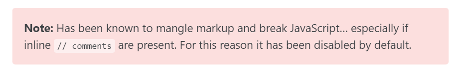

미루기만 했던 블로그 개편과 꾸미기에 대한 내용을 이 포스팅에 정리하려고 한다.


## 시작한 이유

쏘 심플한 퀘스쳔...정리하려고 쓴 블로근데 정리가 안돼서..

그리고 테마를 받아서 쓰다보니 아무래도 내 입맛에 맛게 예쁘지도 않다.

그래서 하나하나 뜯어고친 기록들을 이번 포스팅에 남기려고 한다.

한번에 잘하면 좋겠지만 그렇게는 힘들고..차근차근 업데이트할 예정이다.


<br>

## 개선 내역

### favicon 추가

다음과 같은 이미지를 파비콘으로 추가해주었다. 블로그가 한층 귀여워졌다.


### 폰트 변경

`__reset.scss` 파일을 조금씩 수정하다가 `main.scss` 파일로 덮어씌우는 방식으로 고쳤다.


### On this Page(toc) 만들기

```yaml
toc: true # 오른쪽 부분에 목차를 자동 생성해준다.
toc_label: "table of content" # toc 이름 설정
toc_icon: "bars" # 아이콘 설정
toc_sticky: true # 마우스 스크롤과 함께 내려갈 것인지 설정
```

페이지에 다음과 같이 추가해주면 된다. 그런데 이렇게 하면 모든 페이지마다 yml설정에 써줘야하니까 번거롭다. 나는 모든 포스팅에 On this Page가 필요하므로 어딘가 싱글페이지 설정에 추가해줘야겠다고 생각했다.

우선 **On this Page**라는 글자가 마음에 들지 않아서 `ui-text.yml` 파일을 열어 `toc_label`을 **Table of Contents**로 수정해주었다.

그런다음 `_config.yml`파일에서 post 설정에 `toc`, `toc_icon`, `toc_sticky` 를 설정해주었다. `toc_label`은 앞서 설정했으니 패스.


<br>

## 앞으로 남은 개선 사항

- 필요한 VsCode 플러그인 다운받기

- 페이지에 삽입되는 이미지 날짜별로 폴더에 넣기

- callout 색깔별로 어떻게 쓰는지 알아내기

  

- prev, next에 해당 포스트의 제목 적어주기

  

- Category-archive 페이지 제목을 오밀조밀하게 설정하기
  지금은 너무 제목이 커서 한눈에 안들어온다.
  
- 컬러설정하기
  - hover 했을 때도 그렇고, 링크도 색깔이 잘 안나온다.
  
- 링크를 넣을 때 마치 카카오톡처럼 해당 페이지의 썸네일이 나오면 좋겠다

- 포스트 썸네일을 모두 레고이미지로 통일했는데, defalut 이미지는 있지만 포스팅에 이미지가 있으면 그걸 썸네일로 쓰고 싶다.

- toc를 모든 포스팅에 적용하기

- 404에러 페이지 만들기

- 카테고리 정리하기

- 필요없는 포스팅 정리하기

- 이름규칙 : 최대한 영어로 안겹치도록 정하자

- `H2` 와 `H3` 사이에 생기는 간격이 미묘하다..조정이 가능했으면


<br>

## References

- [다크모드](https://etch-cure.github.io/blog/toggle-dark-mode/)
- [폰트수정하기](https://evenharder.github.io/blog/jekyll-change-fonts/)
- [지킬 블로그 수정하기 편한 vscode 플러그인 추천](https://etch-cure.github.io/blog/github-pages-plugin/)
- [기본 설정 및 on the page 추가](https://syki66.github.io/blog/2020/04/12/minimal-mistakes-theme.html)
- [식빵맘 - 블로그 마크다운 꿀팁](https://ansohxxn.github.io/blog/markdown/)
- [문자박스](https://eona1301.github.io/a_to_z/GithubBlog/)

