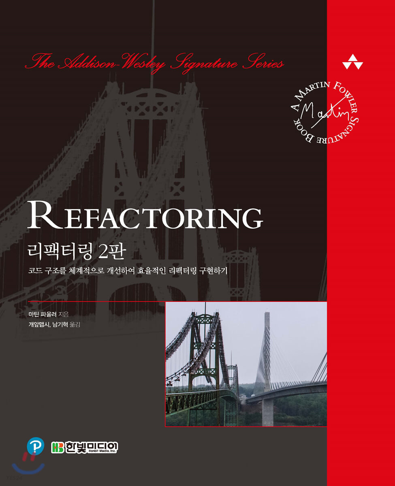

## 0. 학습 계기

처음엔 드림코딩 앨리님의 추천영상을 보고 사두었던 책이었다.   
언젠가 연이되면 읽겠지..하는 마음으로 책장에 쌓아두다가 회사에서 같이 읽자는 제안을 받아서 일주일에 한 챕터씩 가볍게? 읽기로 하였다. 이펙티브 자바처럼 어려운 느낌은 아니라서 슥슥 보려고 시작하게 되었다. (과연..)

## 1. 학습 교재

>  리팩터링(2판) : 코드 구조를 체계적으로 개선하여 효율적인 리팩터링 구현하기 - 마틴 파울러 저

## 2. 학습 방향

챕터 별 요약이나 새로 알게된 내용은 [study-refactoring 깃허브 저장소](https://github.com/JinJungs/study-refactoring.git) 의 README에 먼저 적은 후 블로그에 정리해서 포스팅한다.

그 후 구글 스프레드 시트에 요약내용을 스터디원들과 공유한다.

## 3. 학습목표

나는 이번 스터디로 다음과 같은 것들을 알고 싶다.

- 언제 리팩토링을 해야하는가?
- 어떻게 리팩토링을 해야하는가?
- 리팩터링 시 A라는 방법과 B라는 방법 중 어떤게 좋은 방법인가?
- 자동화된 테스트 만들기

책을 다 읽은 후 다음 내용들에 대한 답을 적어보면 배운 내용이 내 것이 되었다고 말할 수 있을 것 같다. 그럼 시작해보자!

