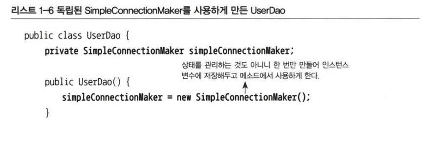

# 1.3 DAO의 확장

## 1.3.1 클래스의 분리 (makeConnection 분리)

상속에는 여러가지 문제가 있다.

따라서 아예 상속관계도 아닌 독립적인 클래스로 만들어 보자.

SimpleConnectionMaker라는 새로운 클래스를 만들고 DB 생성 기능을 그 안에 넣는다. add/get 메소드에서 이를 이용해 DB커넥션을 가져온다.




<br/>

DB 커넥션 생성 기능을 독립시킨 SimpleConnectionMaker는 다음과같다.


그런데 이제 다시 N사와 D사에 공급하는 것이 다시 불가능해졌다. 이런 문제의 근복적인 원인은 UserDao가 바뀔 수 있는 정보, 즉 DB 커넥션을 가져오는 클래스에 대해 너무 많이 알고 있기 때문이다. (이름, 메소드명까지 알아야함)


<br/>

## 1.3.2 인터페이스의 도입

문제를 해결하는 가장 좋은 해결책은 중간에 추상적인 느슨한 연결고리를 만들어주는 것이다.

<div class="notice--info" markdown="1">
💡 추상화란 어떤 것들의 공통적인 성격을 뽑아내어 이을 따로 분리해내는 작업이다. 


자바가 추상화를 위해 제공하는 가장 유용한 도구는 바로 인터페이스다. 


인터페이스는 어떤 일을 하겠다는 기능만 정의해놓은 것이다.

</div>


그러나 여전히 DConnection 클래스의 생성자를 호출해서 오브젝트를 생성하는 코드가 여전히 UserDao에 남아있다.

```java
connectionMaker = new DConnectionMaker();
```


<br/>

## 1.3.3 관계설정 책임의 분리

여전히 UserDao에는 어떤 ConnectionMaker 구현 클래스를 사용할지를 결정하는 코드가 남아있다. 즉 , 또 다른 관심사항이 존재하고 있기 때문이다. 클라이언트 오브젝트는 바로 제 3의 관심사항인 UserDao와 ConnectionMaker 구현 클래스의 관계를 결정해주는 기능을 분리해서 두기에 적절한 곳이기 때문이다.

<div class="notice--info" markdown="1">
💡 관계설정의 책임은 클라이언트로 떠넘긴다.


</div>


<br/>

## 1.3.4 원칙과 패턴

> TODO! 이부분 설명을 더 보충할 것!

- **개방 폐쇄 원칙**
- **높은 응집도**
- **낮은 결합도**
- **전략 패턴**


<br/>

<br/>

# 1.4 제어의 역전(IoC)

## 1.4.1 오브젝트 팩토리

지금 UserDaoTest는 기존에 UserDao가 직접 담당하던 기능, 즉 어떤 ConnectionMaker 구현 클래스를 사용할지를 결정하는 기능을 같이 맡았다.

(얼렁뚱땅🤪) 

이 관심사도 분리해야한다.


<br/>

### 팩토리

: 객체의 생성 방법을 결정하고 그렇게 만들어진 오브젝트를 돌려주는 오브젝트


<br/>

## 1.4.2 오브젝트 팩토리의 활용


Dao의 종류가 많아진다면, 그리고 connection을 바꿔줘야한다면 모든 메서드를 다 일일히 수정해야하는 번거로움이 발생하게 된다.

그렇다면 역시 분리해내는게 가장 좋다. 


<br/>

## 1.4.3 제어권의 이전을 통한 제어관계 역전

제어의 역전에서는 오브젝트가 자신이 사용할 오브젝트를 스스로 선택하지 않는다. 당연히 생성하지도 않는다. 또 자신도 어떻게 만들어지고 어디서 사용되는지를 알 수 없다. 모든 제어 권한을 자신이 아닌 다른 대상에게 위임하기 때문이다.

이미 여러 예에서 제어의 역전 개념을 발견할 수 있다.

- 서블릿
- 디자인 패턴
- 프레임워크
  - 프레임워크는 단지 추상 라이브러리의 집합이 아니다.
  - 라이브러리를 사용하는 애플리케이션 코드는 애플리케이션 흐름을 직접 제어한다. 단지 동작하는 중에 필요한 기능이 있을 때 능동적으로 라이브러리를 사용할 뿐이다.
  - 반면 프레임워크는 거꾸로 애플리케이션 코드가 프레임워크에 의해 사용된다. 보통 프레임워크 위에 개발한 클래스를 등록해두고, 프레임워크가 흐름을 주도하는 중에 개발자가 만든 애플리케이션 코드를 사용하도록 만드는 방식이다.

<div class="notice--info" markdown="1">
💡 프레임워크에는 분명한 제어의 역전 개념이 적용되어 있어야 한다.
애플리케이션 코드는 프레임워크가 짜놓은 틀에서 수동적으로 동작해야 한다.


</div>

<div class="notice--info" markdown="1">
💡 제어의 역전에서는 프레임워크 또는 컨테이너와 같이 애플리케이션 컴포넌트의 생성과 관계설정, 사용, 생명주기 관리 등을 관장하는 존재가 필요하다. 스프링은 이런 IoC를 극한까지 적용하고 있는 프레임워크다.


</div>
