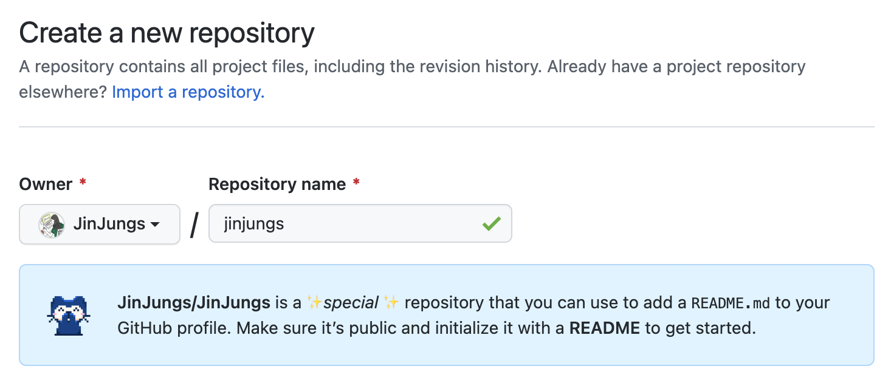
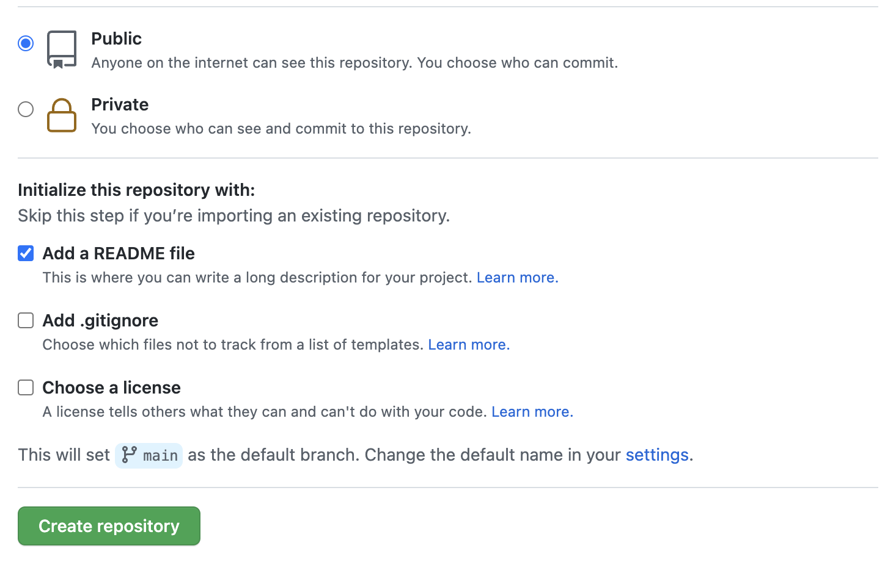
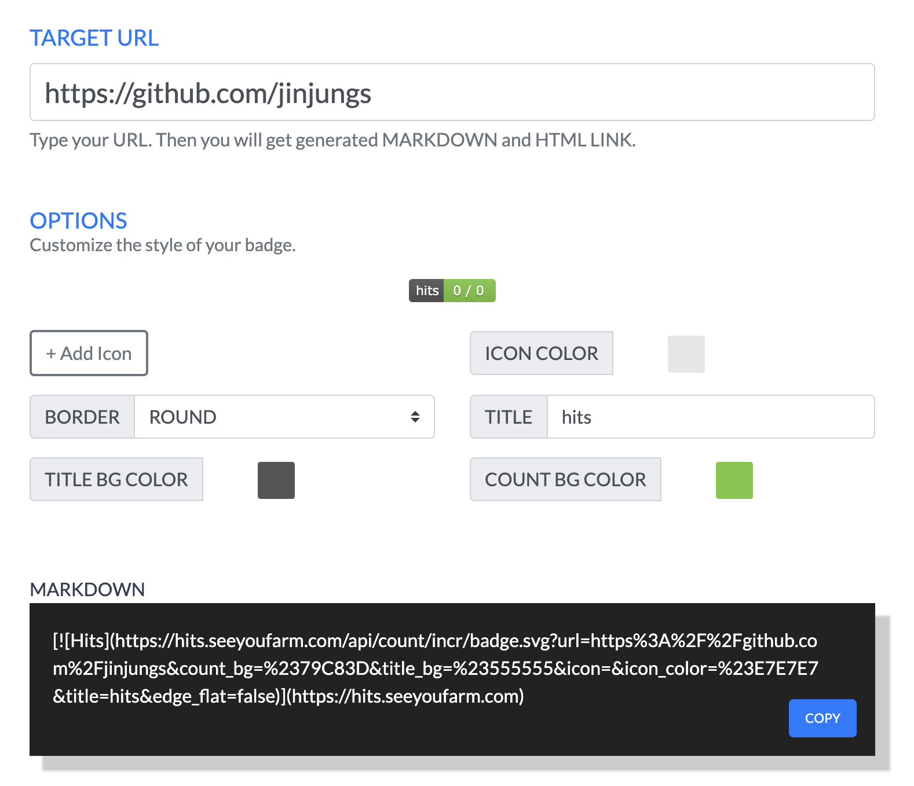
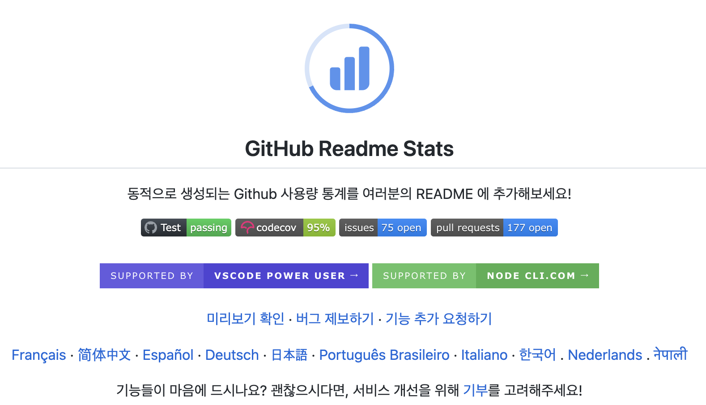

주말에 코딩공부하다가 현타와서 github에 다시 재미를 붙여보고자 깃허브 프로필을 꾸며보았다.

## 1. Repository 만들기

github 계정과 같은 이름으로 repository를 만들면, 다음과 같이 `README` 를 만들어 github profile로 생성할 수 있다는 메세지가 나온다.

 

public 으로 체크 후, `README` 파일을 추가해준다.

 

## 2. 뱃지로 README 꾸미기

### 2.1. HITS로 방문자 수 뱃지 표시하기

👉 [hits.seeyourfarm](https://hits.seeyoufarm.com/)

자신의 프로필 url을 입력하고 나오는 markdown을 복사해서 README 에 넣어주면 된다.

 

### 2.2. Github README Stat 추가하기

👉 [github-readme-stats](https://github.com/anuraghazra/github-readme-stats)

다음 이미지처럼 사용량 통계를 추가해줄 수 있다. 자세한 내용은 위 링크의 readme를 읽어보면 원하는 기능을 더하거나 뺄 수 있다.

이것도 마찬가지로 마크다운에서 username 만 자신의 아이디로 바꿔서 readme 파일에 붙여넣어주면 끝이다.

 

### 2.3. 뱃지 추가하기

👉 https://shields.io/

기술 스택을 추가할 수 있다.

### References

- [[Github] github profile 예쁘게 꾸미기](https://velog.io/@woo0_hooo/Github-github-profile-%EA%B0%84%EC%A7%80%EB%82%98%EA%B2%8C-%EA%BE%B8%EB%AF%B8%EA%B8%B0)