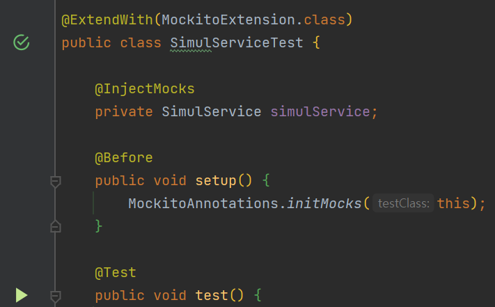

과제 테스트를 치룬 후, JUnit 테스트를 해본 겸 회사프로젝트에도 JUnit을 적용해보기로 했다. 그런데 분명 똑같은 방법으로 한 것 같은데 Inject 된 서비스에서 `NullPointerException` 이 발생했다.

알고보니 @InjectMocks로 Service를 넣어줄 뿐만아니라, @Before로 셋업도 해줘야하기 때문이었다.
해결된 후 코드는 다음과 같다. 문제가 되지 않을 부분만 캡쳐했다.

이제 test()에서 service의 원하는 메소드를 테스트하면 된다!

 

### References

- [StackOverflow - Null after @InjectMocks](https://stackoverflow.com/questions/27065195/null-after-injectmocks)