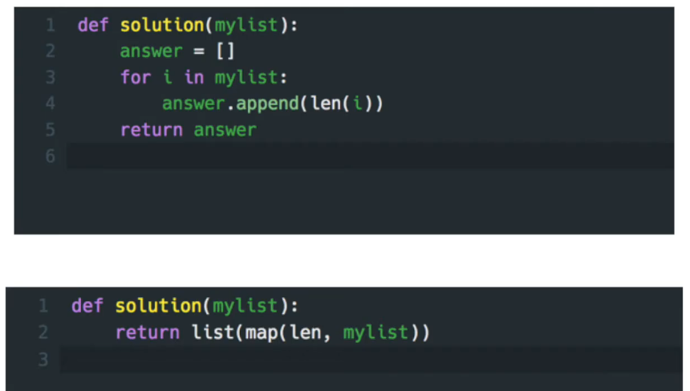

# 파이썬을 파이썬답게

진행중인 강의는 여기서 확인할 수 있다.


프로그래머스에서 진행하는 온라인코스로, 다른 언어에 익숙한 사람들을 위한 더 파이썬스럽게 코드를 작성하는 법을 알려주는 코스다.

- [파이썬을 파이썬답게](https://programmers.co.kr/learn/courses/4008)


<br>

## 🔷 파트1. Python 꿀팁

- [수강전에 이 문제를 풀어보세요.](https://programmers.co.kr/learn/courses/4008/lessons/13254)

```
정수를 담은 이차원 리스트, mylist 가 solution 함수의 파라미터로 주어집니다. mylist에 들은 각 원소의 길이를 담은 리스트를 리턴하도록 solution 함수를 작성해주세요.

제한 조건
mylist의 길이는 100 이하인 자연수입니다.
mylist 각 원소의 길이는 100 이하인 자연수입니다.
```

| input                 | output  |
| --------------------- | ------- |
| [[1], [2]]            | [1,1]   |
| [[1, 2], [3, 4], [5]] | [2,2,1] |




내가 딱 코드를 첫번째처럼 짰는데, 그렇다면 이 강의를 수강해야 한다고 하더라..ㅎㅎ
위코드가 문제가 있다기 보다는, 파이썬 보다 `C`나 `java`코드에 가깝다는게 그 이유이고,
코드를 두번째처럼 짤 수 있도록 만드는 것이 이번 수업의 목표이다.

<span style="color:blue">**느낀점**</span>

`map` 함수를 `int` 나 `str`로만 바꿔서 써봤었는데, `len`으로 길이같은 것도 구할 수 있다는 것을 알았다.


<br>

## 🔷 파트2. 정수 다루기

### 2.1. 몫과 나머지 - divmod

7을 3으로 나눈 몫과 나머지를 구해야 하는 경우 보통은 다음과 같이 풀 수 있다.

```python
a = 7
b = 5
print(a//b, a%b)
```

파이썬에서는 `divmod`와 unpacking을 이용하면 다음과 같이 코드를 짤 수 있다.

```python
a = 7
b = 5
print(*divmod(a, b)) # 2 1
```


### 2.2. n진법으로 표기된 string을 10진법 숫자로 변환하기 - int 함수

보통 사람들은 for 문을 이용해 숫자를 곱해가며 문제를 풉니다.

```python
num = '3212'
base = 5

answer = 0
for idx, number in enumerate(num[::-1]):
    answer += int(number) * (base ** idx)
```

파이썬의 [int(x, base=10)](https://docs.python.org/3/library/functions.html#int) 함수는 진법 변환을 지원합니다.

```python
num = '3212'
base = 5
answer = int(num, base)
```


<br>

## 🔷 파트3. Str 다루기

### 3.1. 문자열 정렬하기 - ljust, center, rjust

공백을 포함해서 총 n자리의 str을 출력하는 중, 문자열 s의 위치를 왼쪽, 가운데, 오른쪽으로 정렬하고 싶다면 어떻게 해야할까?
보통은 for문을 이용해 기존 s에 공백문자`(' ')`를 붙이는 작업을 해준다.
그러나 string 의  [ljust](https://docs.python.org/3/library/stdtypes.html?highlight=rjust#str.ljust), [center](https://docs.python.org/3/library/stdtypes.html?highlight=rjust#str.center), [rjust](https://docs.python.org/3/library/stdtypes.html?highlight=rjust#str.rjust)와 같은 메소드를 사용하면 훨씬 간편하다.

```python
s = '가나다라'
n = 7

s.ljust(n) # 좌측 정렬
s.center(n) # 가운데 정렬
s.rjust(n) # 우측 정렬
```


 