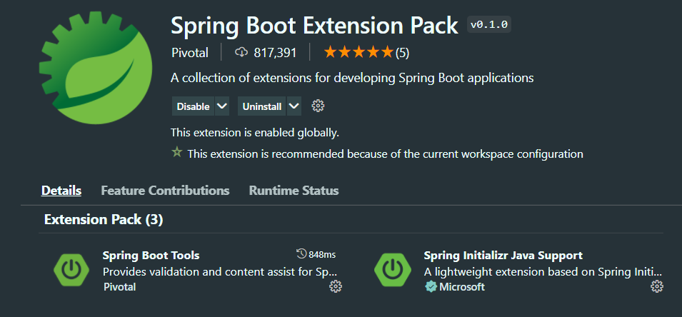

소형씨랑 같이 만들었던 스프링 부트 프로젝트를 리팩토링하기로 했다. 근데 이제 소형씨는 프론트 개발자이다보니 인텔리제이나 이클립스를 다시 설치하고 세팅하기가 부담스러울 것 같아서 최대한 vscode로 스프링 프로젝트를 할 수 있는 방법을 찾아보기 시작했다.


### VSCODE 설치

vscode가 없다면 먼저 vscode를 설치해야한다. 특별한 일이 없다면 **User Installer 버전**으로 설치하면 된다.  
회사에서 VDI 에서 사용할 vscode를 설치할 때는 System Installer 버전으로 설치했다.


### JAVA 11 이상 설치

기존 프로젝트는 java 1.8을 사용하고 있었는데, vscode가 java 11 이상을 지원하면서 `Java 11 or more recent is required` 라는 에러메세지를 뱉었다..ㅠ

당황하지말고 **JAVA 11도 설치**해준 다음, 환경변수 설정에서 JAVA_HOME을 11로 설정해준다.  
그리고 vscode에서 setting으로 java 1.8을 사용하게 설정하면 된다. (방법은 밑에)


<br/>

### Extension 설치

- Extension Pack for Java

  
  
- Spring boot Extension Pack

  


<br/>

### settings.json

1. shift를 두번 눌러 검색창을 띄우고 `settings.json`을 검색한다.

   
   
2. java.configutation.runtimes에 다음과 같이 입력한다. path에는 자신의 컴퓨터에 설치된 jdk의 위치를 쓰면되고, 나머지는 다른 설정이라서 참고하지 않아도 괜찮다. (내가 보려고 남겨둔 것)

   ```json
   	{
       "java.home": "C:\\Program Files\\Java\\jdk-11.0.12",
       "java.configuration.runtimes": [
             {
               "name": "JavaSE-1.8",
               "path": "C:\\Program Files\\Java\\jdk1.8.0_251", // 기존 1.8 JDK SE
             },
             {
               "name": "JavaSE-11",
               "path": "C:\\Program Files\\Java\\jdk-11.0.12", // Open JDK 11 SE
               "default": true
             }
       ],
       "java.configuration.updateBuildConfiguration": "interactive",
       "files.exclude": {
           "**/.classpath": true,
           "**/.project": true,
           "**/.settings": true,
           "**/.factorypath": true
       },
       "java.jdt.ls.vmargs": "-XX:+UseParallelGC -XX:GCTimeRatio=4 -XX:AdaptiveSizePolicyWeight=90 -Dsun.zip.disableMemoryMapping=true -Xmx1G -Xms100m -javaagent:\"c:\\Users\\Admin\\.vscode\\extensions\\gabrielbb.vscode-lombok-1.0.1\\server\\lombok.jar\"",
       "editor.suggestSelection": "first",
       "vsintellicode.modify.editor.suggestSelection": "automaticallyOverrodeDefaultValue",
       "workbench.colorTheme": "Material Theme",
       "workbench.iconTheme": "material-icon-theme"
   	}
   	
   ```


<br/>

### 실행

자 이제 실행을 해보자. 프로젝트의 SpringApplication 파일을 열어보면 다음과 같이 위에 **Run/Debug** 라는 글자가 생긴 것을 볼 수 있다. Run 을 누르면 정상적으로 실행이 되는 것을 확인할 수 있다.


<br/>

`F5` 키로 프로젝트를 실행시키고 싶다면 다음과 같이 Launch Application으로 바꿔준 다음에 실행시키면 된다.


만약 `launch.json`을 설정해야한다는 메세지가 적혀있으면 메세지를 누르고 java를 선택하면 다음과 같이 설정될 것이다.

```json
{
    // Use IntelliSense to learn about possible attributes.
    // Hover to view descriptions of existing attributes.
    // For more information, visit: https://go.microsoft.com/fwlink/?linkid=830387
    "version": "0.2.0",
    "configurations": [
        
        {
            "type": "java",
            "name": "Launch Current File",
            "request": "launch",
            "mainClass": "${file}"
        },
        {
            "type": "java",
            "name": "Launch CocoaApplication",
            "request": "launch",
            "mainClass": "kh.cocoa.CocoaApplication",
            "projectName": "cocoa"
        }
    ]
}
```


이렇게 해야 실행하고 중지시키는 작은 window가 뜨기 때문에 이 방법을 더 추천한다.


<br/>

### References

- [Visual Studio Code 에서 스프링 부트 프로젝트 개발하기](http://honeymon.io/tech/2021/01/06/use-vs-code-for-spring-boot.html)
- [java 11 or more recent is required to run 에러 해결](https://oysu.tistory.com/50)
- [vscode spring boot 공식 문서](https://code.visualstudio.com/docs/java/java-spring-boot)