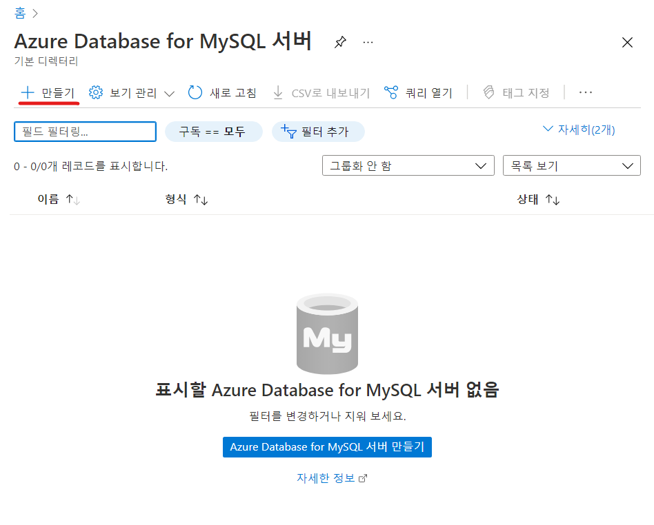
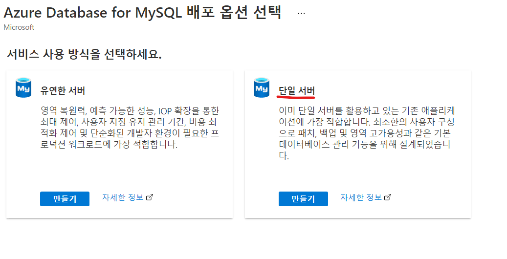
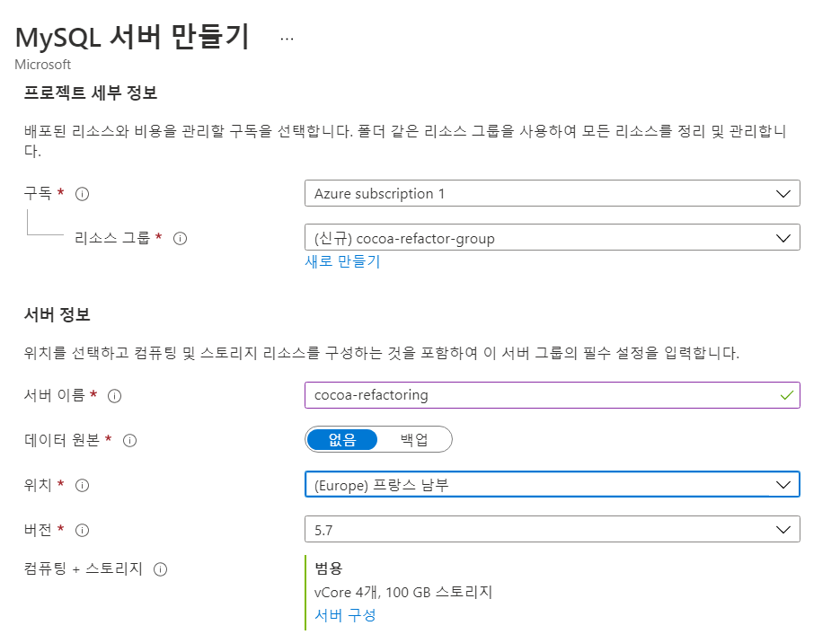
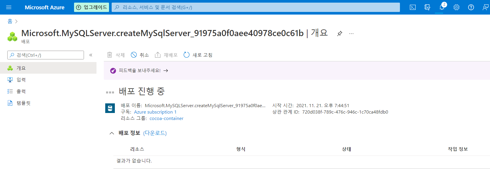
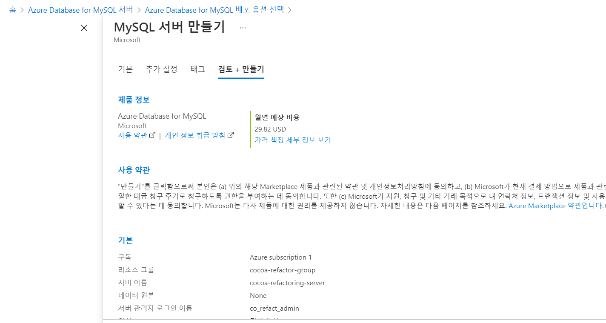
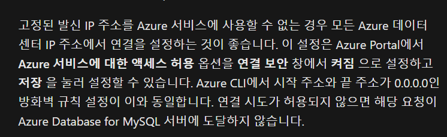
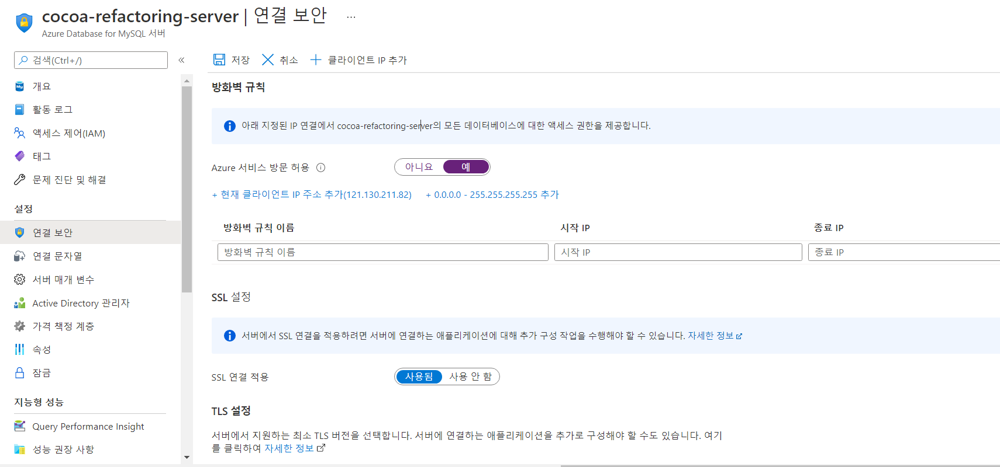

Azure 무료계정을 생성하고 mysql database를 생성해보자

중간에 서버 구성을 클릭하고 제일 낮은 것으로 설정해주자. (안그러면 요금이 많이 나오니까)

### 방화벽 설정

azure database는 기본적으로 <u>특정 IP를 제외한 IP에서 연결이 불가능하도록 방화벽 설정</u>이 되어있다.   
그러나 다수와 협업을 하거나, 카페를 옮겨다니면서 코딩을 해서 불규칙한 IP에서 접속해야하는 경우 **Azure 서비스 방문 허용**을 예로 설정하면 사용이 가능하다.

### References

- [Azure Database for mysql 공식문서](https://docs.microsoft.com/ko-kr/azure/mysql/quickstart-create-mysql-server-database-using-azure-portal)
- [MySQL용 Azure 데이터베이스 서버 방화벽 규칙 공식문서](https://docs.microsoft.com/ko-kr/azure/mysql/concepts-firewall-rules)
- [youtube - Microsoft Azure를 사용하여 5 분 이내에 MySQL 데이터베이스 서버 만들기](https://www.youtube.com/watch?v=fJEfBqWwcL0)

