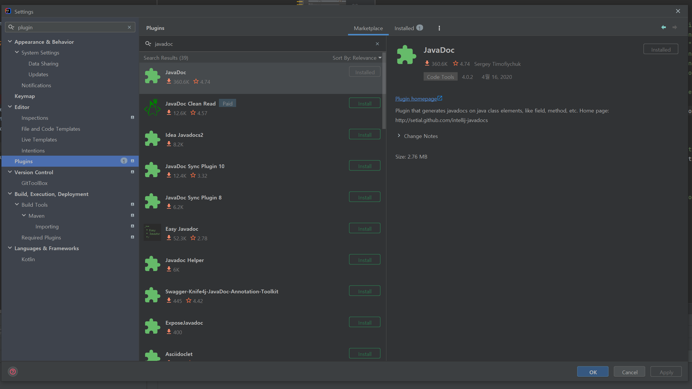
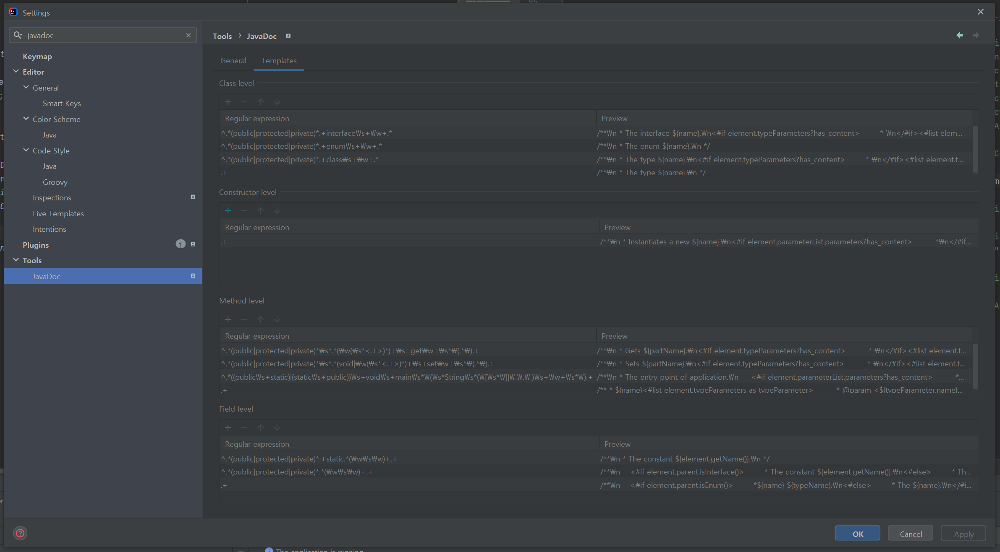
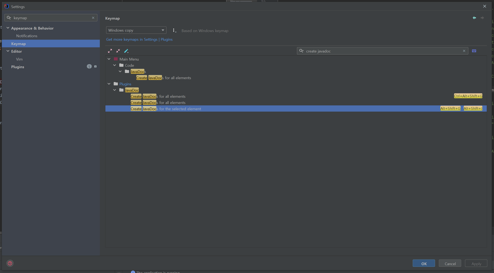

### 상황설명

메서드 위에 @param @return 등 주석을 자동으로 생성해준는 기능을 찾고 있었는데, 분명 이클립스에는 바로 단축키가 있었는데..!!

인텔리제이는 왜 없는거야...

찾아보니 플러그인을 깔아야 하더라..!

### 1. JavaDoc 플러그인 설치

JavaDoc 이라는 플러그인을 설치한다.

### 2. Javdoc 설정

Settings > Tools > JavaDoc> Templates 탭에서 이러쿵 저러쿵 입맛대로 바꾸기가 가능하다.

### 3. 단축키

단축키는 `Alt + Shift + G` 이다. 나는 이클립스와 동일한 단축키인 `Alt + Shift + J`  도 추가해줬다.

 

### References

- [[IntelliJ] 주석 템플릿 설정하기 (Code Template, JavaDoc)](https://ifuwanna.tistory.com/312)