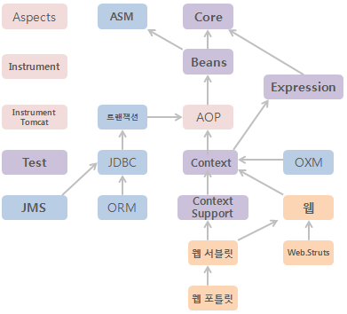
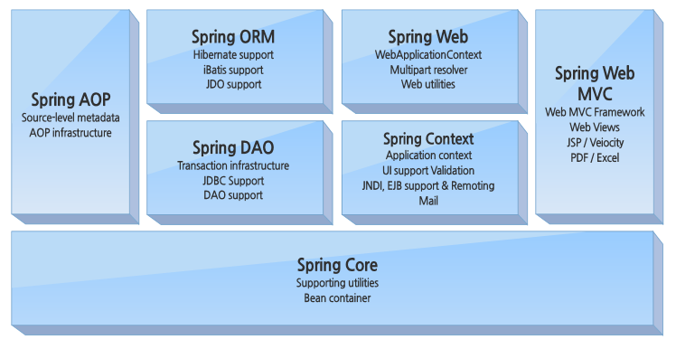
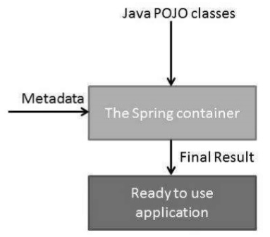

---

title: '[스프링 따라하기] 첫 번째 주'
excerpt: '스프링 따라하기 프로젝트'
published: false
date: '2021-09-17T16:43:03.971Z'
categories:
    - spring
tags:
    - tag1
header:
    teaser: ../../img/2021-09-18-spring-imitate-1/spring-module-dependency.png
---


## 스프링 모듈

### (1) 스프링 모듈 의존성







### (2) 진행순서

- Core, Beans, ASM
- AOP, 트랜잭션, JDBC, ORM
- Context, OXM
- Context Support, 웹서블릿, 웹


### (3) 공부 방향

기존의 스프링 프레임워크에 있는 라이브러리들을 하나씩 뜯어보면서 진행하려고 했는데, 너무 방대하고, 그런식으로 코드를 쫓아가기엔 끝이 없다는 생각이 들었다. 그래서 스프링 공식 docs를 바탕으로 각각의 모듈 중 구현해야할 핵심파트가 무엇인지를 파악하는 시간을 가진뒤, 하나씩 구현해가기로 하였다.


<br>

## 이번에 구현할 파트

### ASM

클래스 바이트코드 조작 및 분석 프레임워크인 ASM을 재 패키징한 모듈이다. 엄연히 말하면 스프링 모듈은 아니지만 ASM을 사용하는 타 프레임워크와의 충돌 방지를 위해 `org.springframework.asm` 패키지로 재패키징해 독립적인 모듈로 제공한다.


### Core

다른 스프링 모듈에서 필요로 하는 공통 기능을 갖는 핵심 모듈이다. 주요 어노테이션, 컨버터, 상수, 유틸리티 클래스 등을 제공한다. 공식문서에는 다음과 같은 모듈로 이루어져있다고 나와있다.

- spring-core
- spring-beans
- spring-context
- spring-context-support
- spring-expression

선택적 의존 - ASM
{: .notice-info}


**Spring BeanFactory Container**

- 가장 기본이 되는 DI는 `org.springframework.beans.factory.BeanFactory` 인터페이스에서 제공해준다.

- `BeanFactoryAware`, `InitializingBean`, `DisposableBean` 과 같은 연관된 인터페이스는 제 3의 프레임워크와의 호환성을 위해 여전히 존재한다.

- 가장 많이 사용되는 `BeanFactory` 의 구현체는 **XmlBeanFactory**  이다.

  - 근데 Deprecated 되었다.

  - ```java
    Deprecated
    as of Spring 3.1 in favor of DefaultListableBeanFactory and XmlBeanDefinitionReader
    ```

    

- 이 컨테이너는 XML 파일에서 configuration metadata를 읽고 시스템 구성을 만든다.

- 하지만 모바일기기와 같이 리소스가 제한된 곳에서 사용하므로, 다른 이유가 있지 않는한 ApplicationContext를 사용하는 것이 좋다.

**Spring Application Container**

- 엔터프라이즈 환경에 더 맞는 기능을 제공한다.
- `org.springframework.context.ApplicationContext` 인터페이스에서 제공해준다.
- 가장 인기있는 구현체는 아래 세개가 있다.
  - **FileSystemXmlApplicationContext** 
  - **ClassPathXmlApplicationContext** 
  - **WebXmlApplicationContext** 

- properties 파일에서 텍스트를 읽고 해석하는 능력이 있다.
- application events를 event listeners에게 전달할 수 있다. (publish application)





### Beans

스프링의 DI 기능의 핵심인 빈 팩토리와 DI기능을 제공하는 모듈이다. 빈 메타정보, 빈 리더, 빈 팩토리의 구현과 프로퍼티 에디터가 포함되어 있다. 모바일같은 제한된 환경에서 스프링의 DI기능만 적용하고 싶으면 Beans 모듈까지만 적용하면 된다.

필수 라이브러리 - ASM, Core
{: .notice-info}


## References

- [spring framework 4.3 docs](https://docs.spring.io/spring-framework/docs/4.3.x/spring-framework-reference/htmlsingle/)

- [spring framework 2.x docs 한글번역](http://ldg.pe.kr/framework_reference/spring/ver2.x/html/index.html)

- [DOLOLAK - 스프링 모듈 구조](https://dololak.tistory.com/21?category=636502)

- [성택님 - 스프링 따라하기](https://seongtaekkim.github.io/springframework-architecture)

- [tutorialspoint - IoC Containers](https://www.tutorialspoint.com/spring/spring_ioc_containers.htm)

