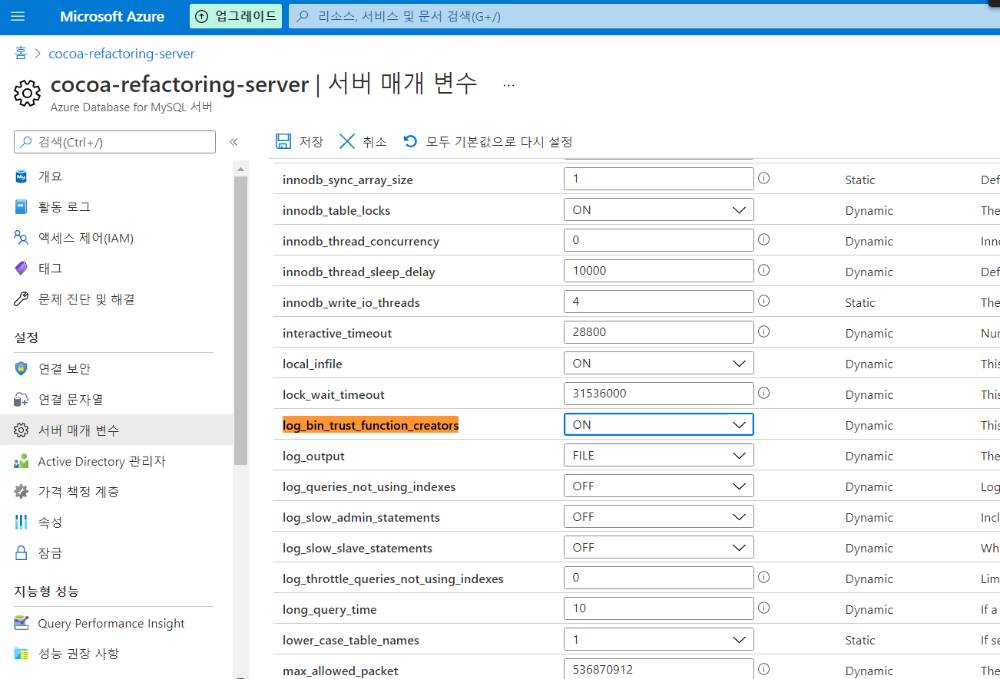

### mysql에서는 시퀀스 기능이 미지원

예전에 만들었던 프로젝트를 리팩토링하는 과정에서, 기존 DB를 oracle에서 mysql로 옮기고자 시도하였다.  
이유는 단순히 회사에서 mariadb를 사용하기 때문에...근데 mariadb보단 mysql도 한번 써보고 싶었다.

근데 생각치 못한 문제에 봉착했다.  
바로 mysql에서는 시퀀스 기능을 지원하지 않는 것이다.

그래서 다음 글을 참조하면서 sequence 기능을 구현해보고자 한다.

### References

- [Mysql에서 Sequence 기능을 사용하는 방법](https://proudin.tistory.com/28)
- [SEQUENCE NEXTVAL 구현 프로시져](https://bulkywebdeveloper.tistory.com/62)
- [[AWS RDS] You do not have the SUPER privilege and binary logging is enabled 에러 발생 시](https://medium.com/sjk5766/aws-rds-you-do-not-have-the-super-privilege-and-binary-logging-is-enabled-%EC%97%90%EB%9F%AC-%EB%B0%9C%EC%83%9D-%EC%8B%9C-f9ce557269fd)

- [공식문서 -  Azure Database for MySQL로 마이그레이션하는 동안 또는 마이그레이션 후에 일반적으로 발생하는 오류](https://docs.microsoft.com/ko-kr/azure/mysql/howto-troubleshoot-common-errors)

- [MySQL(MariaDB) 서버 타임존 설정하기](https://offbyone.tistory.com/318)

- [java.sql.SQLException: No database selected](https://myybean.tistory.com/12)
- [mysql에서 rownum 사용하기](https://dong-guri.tistory.com/5)

